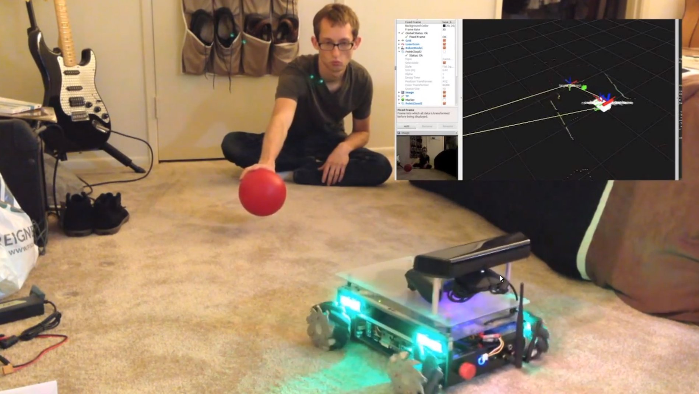

mecanumbot-ros-pkg
==================

A ROS package for the Mecanumbot robot.

## Summary

The Mecanumbot robot is a robotic development platform designed, built, and maintained by [Josh Villbrandt](mailto:josh@javconcepts.com). It features a holonomic drive platform with mecanum wheels as well as a 2D laser scanner and an RGB-D camera. Research goals in localization, navigation, and object recognition from point clouds. Learn more about the Mecanumbot at [JAV Concepts](http://javconcepts.com/tag/mecanumbot/).

## Documentation

A variety of guides are available in the `docs/` folder.

* [Setup Guide](docs/Setup Guide.md)
* [Usage Guide](docs/Usage Guide.md)
* [Implementation Guide](docs/Implementation Guide.md)
* [Work Log](docs/Work Log.md)
* [Todo List](docs/Todo List.md)

## Releases

This package uses [semantic versioning](http://semver.org/).

| Version | Notes |
| --- | --- |
| future | Re-added gmapping launch file. |
| future | Target follower now uses dynamic_reconfigure. Fixed phantom LED and motor message. |
| future | Refactoring LED messages and xbox controller mapping for LEDs. Added barometer telemetry. Refactored documentation.  |
| [v0.3.0](https://github.com/joshvillbrandt/mecanumbot/releases/tag/v0.3.0) | Ball tracking code refactored to HSV. Added power board telemetry. |
| [v0.2.0](https://github.com/joshvillbrandt/mecanumbot/releases/tag/v0.2.0) | Updating for Hydro. New ball tracking with target follower. |
| [v0.1.0](https://github.com/joshvillbrandt/mecanumbot/releases/tag/v0.1.0) | Last working version of the mecanumbot package for ROS Groovy. |
